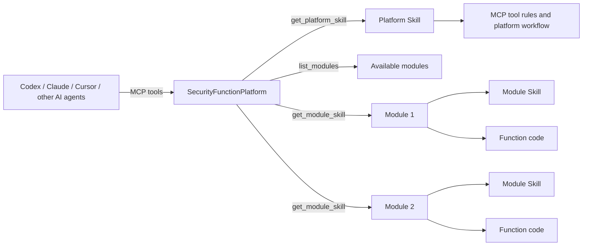

# SecurityFunctionPlatform

[English](README.md) | [简体中文](README.zh-CN.md)

SecurityFunctionPlatform is an MCP-native module and Skill management runtime for AI agents.

The platform packages specific capabilities as removable modules. Each module can carry code, workflows, configuration fields, knowledge assets, Skill instructions, a machine-readable playbook, raw-output sorters, and a final-result schema. MCP-capable AI clients, such as Codex, Claude Desktop, Cursor, or other compatible agent hosts, can list modules, load only the selected module Skill, run module functions, save final results, and, after user approval, iterate module code so future runs use fewer tokens and produce better output.

## Calling Relationship



## Product Positioning

AI-orchestrated execution loop:

```text
workflow execution
-> workflow results return to AI
-> AI plans and executes the next step
-> function result returns to AI
-> AI repeats the planning/execution loop
-> AI writes the final conclusion
-> final conclusion is saved and returned to the frontend
```

This project is not a general low-code chatbot builder. It is a local capability runtime for AI agents.

Core goals:

- **Modular capabilities**: put each specific capability in `modules/<module_id>/`.
- **Removable modules**: create, import, export, package, and validate modules.
- **Skill management**: load platform Skill first, then load only the selected module Skill/playbook/schema.
- **Token reduction**: avoid giving the AI every module's context; use `list_modules` then `get_module_skill(module_id)`.
- **Controlled code iteration**: after user approval, useful code, raw sorters, schemas, and knowledge can be written back into the selected module.
- **Module-owned frontend pages**: modules can declare knowledge-backed pages in `module.json.ui.pages`, while rendering stays inside platform-owned frontend components.
- **Result persistence**: raw outputs, AI-facing outputs, and final summaries are saved under the current session.
- **Built-in reconnaissance module**: see [Recon Scan Module](modules/recon_scan/README.md) for the active/passive target reconnaissance module design, the AI-gated follow-up loop, and the final report flow.

## Install And Run

### 1. Clone

```powershell
git clone <repo-url>
cd SecurityFunctionPlatform
```

### 2. Install

```powershell
python -m pip install -e ".[dev]"
```

### 3. Start The Local API And Web UI

```powershell
python -m uvicorn security_function_platform.api.main:app --reload --host 127.0.0.1 --port 8111
```

Open:

```text
http://127.0.0.1:8111/
```

Useful pages:

- `http://127.0.0.1:8111/`: analysis workbench for sample upload, session selection, workflow selection, workflow runs, and current-session final results.
- `http://127.0.0.1:8111/modules.html`: module import/export/package and workflow template management.
- `http://127.0.0.1:8111/module-page.html?module=<module_id>&page=<page_id>`: module-specific knowledge page rendered from `module.json.ui.pages`.
- `http://127.0.0.1:8111/config.html`: local configuration fields.
- `http://127.0.0.1:8111/platform.html`: platform Skill paths, MCP tool roles, and module Skill/function paths.
- `http://127.0.0.1:8111/raw-data.html`: map-first raw output and AI output lookup.
- `http://127.0.0.1:8111/result.html?session_id=<session_id>`: final AI summary for one session.

### 4. Start The MCP Server

Start the local API first. Then add this MCP server configuration to Codex's `config.toml`, or to the equivalent MCP client configuration file:

```toml
[mcp_servers.security-function-platform]
command = "python"
args = ["-m", "security_function_platform.mcp_server.server"]
startup_timeout_sec = 30
tool_timeout_sec = 120
enabled = true

[mcp_servers.security-function-platform.env]
SECURITY_FUNCTION_PLATFORM_API_BASE = "http://127.0.0.1:8111"
```

After writing the configuration, restart Codex so the MCP server is loaded. Use the same Python interpreter for installation and MCP startup. If startup fails with `RuntimeError: mcp package is not installed`, run `python -m pip install -e ".[dev]"` in the project root, then restart Codex again.

## Codex MCP Usage In Practice

Codex is an MCP client, and SecurityFunctionPlatform is the local MCP capability platform. Modules are not tied to Codex; any MCP-capable AI client can use the same platform flow.

### 1. Recommended Flow

A complete analysis usually follows this order:

1. Codex calls `get_platform_skill` to read platform rules.
2. Codex calls `list_modules` to list available modules.
3. Codex asks the user to choose a module, unless the user already named one.
4. Codex calls `get_module_skill(module_id)` to load only the selected module's Skill, playbook, and final result schema.
5. Codex uploads a sample, creates a target session, or selects an existing session.
6. Codex selects a workflow, or directly runs one function.
7. Codex analyzes `ai_output` first.
8. When evidence detail is needed, Codex calls `get_raw_output_map` first, then fetches only the necessary `raw_output_id`.
9. Codex writes the final summary according to the selected module schema and saves it with `save_session_result`.

For the built-in `recon_scan` module, the preferred finalization path is:

1. run workflow or one follow-up function
2. inspect `ai_output`
3. refresh `recon.attack_surface_summarize`
4. refresh `recon.next_step_options`
5. generate `recon_final_report` with `recon.report_generate`
6. save `recon_final_report.data.final_result` with `save_session_result`

If the structured report result is unavailable, the frontend-compatible fallback can still be built from `recon_attack_surface`.

### 2. Module Selection And Creation

Codex can reuse existing modules or create a new module:

- Use `list_modules` to inspect available modules.
- Use `get_module_template` to inspect the default module layout.
- Use `create_module` to create a new module in the default format.
- Use `get_module_detail(module_id)` to inspect functions, workflows, config fields, and validation state.
- Use `get_module_ui(module_id)` to inspect module-specific frontend page declarations.
- Use `get_module_knowledge(module_id, knowledge_type)` to fetch one declared knowledge asset for a module page.

Modules carry specific capabilities, such as an analysis domain, tool wrapper, report format, or knowledge asset. Platform Skill should not hardcode module contents; Codex should discover modules first, then load the selected module context.

### 3. Workflow Or Single Function

Codex can choose either execution mode:

- **Workflow mode**: best for stable and repeatable tasks. Codex selects or creates a workflow, the platform runs multiple functions, Codex analyzes the returned `ai_output`, and Codex continues with focused follow-up analysis when needed.
- **Single-function mode**: best for quick exploration or additional evidence. Codex can call `run_function` in the current session.

The built-in `recon_scan` module uses an AI-gated single-step follow-up pattern outside the default workflow. After the basic workflow, AI should normally run at most one of:

- `recon.service_identify`
- `recon.web_light_discover`
- `recon.vulnerability_candidate_scan`

Then it should re-summarize and refresh next-step options before making another decision.

Workflows reduce repeated planning and explanation overhead because common multi-step function calls are saved as reusable templates.

### 4. Code Writing And Self-Iteration

Codex should not modify code by default. Module code writing and self-iteration require clear user approval:

- Before analysis starts, Codex asks whether module self-iteration is allowed for this task.
- After the final result is saved, Codex asks again before applying any useful iteration.
- After approval, Codex edits only the selected module, such as `functions/`, `config_files/`, `config_fields/`, or `skill/`.
- Codex does not self-iterate platform code during sample analysis.
- Useful temporary code can become a module function; noisy output should usually be handled by improving the module raw sorter.

The goal of iteration is more stable module output, smaller AI context, and better future results.

### 5. Final Result Saving

Codex should not only return the conclusion in chat. At the end of analysis, it should produce the final summary according to the selected module's `final_result_schema` and save it with `save_session_result`:

```text
data/sessions/<session_id>/result/result.json
```

The frontend result page reads this session result. If the page is empty, the final result has usually not been saved yet.

For `recon_scan`, the analysis workbench prefers the saved `recon_final_report` result when it exists. If that result has not been generated yet, it can fall back to the attack-surface summary result so the operator can still inspect the current state.

### 6. Common Issues

- **MCP startup fails**: check whether the same Python environment installed the project dependencies, especially the `mcp` package.
- **Module does not appear**: check whether `modules/<module_id>/module.json` exists and is valid.
- **Workflow cannot run**: check whether both a session and a workflow have been selected.
- **Config fields are empty**: fill tool paths, API keys, tokens, and other local values in the config page; secret values are redacted in the UI.
- **Raw output is too large**: do not fetch everything by default; inspect `ai_output` first, then query specific raw output by `raw_output_id`.

## Platform Function Guide

### 1. Platform Skill Loading

AI agents should start with:

1. `get_platform_skill`
2. `list_modules`
3. user/module selection
4. `get_module_skill(module_id)`

`get_platform_skill` returns only platform-level rules. Module-specific rules are loaded on demand through `get_module_skill(module_id)` so the AI does not waste context on unrelated modules.

### 2. Module Discovery And Selection

Use:

- `list_modules`: list available modules.
- `get_module_detail(module_id)`: inspect one module's manifest, functions, workflows, config fields, and validation state.
- `get_module_skill(module_id)`: load the selected module's `SKILL.md`, `playbook.json`, and `final_result_schema.json`.
- `list_module_knowledge`: list module knowledge assets without loading all contents.
- `get_module_ui(module_id)`: inspect one module's frontend page declarations.
- `get_module_knowledge(module_id, knowledge_type)`: fetch one declared module knowledge asset.

Modules are usable by discovery. The compatibility load endpoint still exists for validation.

### 3. Module Creation

Use:

- `get_module_template`: inspect the default module layout and manifest format.
- `create_module`: create a default module skeleton under `modules/<module_id>/`.

Default module layout:

```text
modules/<module_id>/
  module.json
  functions/
  workflows/
  knowledge/
  config_fields/
  skill/
    SKILL.md
    playbook.json
    final_result_schema.json
  config_files/
```

Modules may also keep additional supporting Skill documents under `skill/` when the main `SKILL.md` needs to reference narrower guidance. The current `recon_scan` module uses this pattern for:

- controlled execution rules
- scan-strategy guidance
- final-result writing guidance

Important rules:

- Declare every reusable function in `module.json`.
- Put module config field declarations in `config_fields/`.
- Put module resources in `config_files/`.
- Put module knowledge assets in `knowledge/` and declare reusable module pages in `module.json.ui.pages`.
- Put module Skill/playbook/final result schema in `skill/`.
- Before writing a new file, inspect the module directory and nearby file roles.

### 4. Module Frontend Pages

Module pages are declarative. A module declares pages in `module.json.ui.pages`, each page points at an already declared `knowledge_type`, and the platform renders the page with trusted renderers such as `knowledge_table` or `taxonomy_browser`.

Use:

- `get_module_ui(module_id)`: inspect existing page declarations.
- `get_module_knowledge(module_id, knowledge_type)`: inspect the exact knowledge asset a page will render.
- `upsert_module_ui_page(...)`: create or replace one page declaration after the user approves module iteration.

Do not ship arbitrary module-owned frontend JavaScript for trusted rendering. Add a new platform renderer in `web/module-page.js` only when a new reusable page type is genuinely needed.

### 5. Module Import, Export, And Packaging

Use:

- `package_module(module_id)`: package a module as `.sfpmod.zip`.
- `export_module(module_id)`: alias for module export.
- `import_module_archive(archive_path)`: import a trusted local module archive.
- Web UI module import/export: use the Modules area on the homepage.

Packaging excludes runtime data, session files, secrets, virtual environments, and denied paths.

### 6. Function And Workflow Execution

Use:

- `list_functions`: list registered platform and module functions.
- `list_custom_workflows`: list saved platform and module workflow templates.
- `save_custom_workflow`: save a new workflow template.
- `select_custom_workflow`: apply a workflow template to a session.
- `run_workflow`: run the workflow and return compact `ai_output`.
- `run_batch_workflow`: run a short workflow synchronously across multiple sessions and save a sample-set report.
- `submit_batch_workflow_job`: submit a long-running batch workflow as a persisted background job.
- `list_batch_jobs` / `get_batch_job`: inspect queued, running, completed, or failed batch jobs.
- `list_sample_set_reports` / `get_sample_set_report`: inspect saved cross-sample reports.
- `run_function`: run one additional function in the current session.

Workflow templates support metadata such as risk, network use, config requirements, tags, and default-safe status.
Use `submit_batch_workflow_job` for VMware dynamic workflows or other long-running analysis, even for a single session, so the run can be polled and recovered if the client times out.

The reverse module also exposes `ti.malwarebazaar.download_sample` as a controlled sample-source function. It requires explicit confirmation, downloads into local quarantine, verifies SHA256 before returning a path, and should be followed by upload/analysis cleanup.

### 7. Session Output Model

The platform stores three layers of output:

- **Raw output**: complete original function output in `data/sessions/<session_id>/raw_output/raw_output.json`.
- **AI output**: compact sorted output in `data/sessions/<session_id>/ai_output/ai_output.json`.
- **Final result**: AI-written final summary in `data/sessions/<session_id>/result/result.json`.

AI agents should analyze `ai_output` first. If raw evidence is needed:

1. call `get_raw_output_map(session_id)`
2. choose the needed `raw_output_id`
3. call `get_raw_output_by_id(session_id, raw_output_id)`

Do not fetch all raw outputs by default.

### 8. Cross-Sample Reports

Batch runs save a taxonomy-driven cross-sample report under `data/reports/<report_id>/`:

- `report.json`: structured report for the frontend and MCP tools.
- `report.md`: human-readable delivery draft.

`sample_set.report.v2` uses `sample_facts`, `behavior_matrix`, `attack_matrix`, `validation_status`, and `knowledge_links`. Use `behavior_matrix` as the primary source for how many attack behavior classes were identified, which samples hit each behavior, and which ATT&CK techniques are linked to those behaviors.

### 9. Final Result Schema

Each module can define its own final summary shape in:

```text
modules/<module_id>/skill/final_result_schema.json
```

After analysis, the AI should format the final summary according to the selected module schema and save it with:

```text
save_session_result(session_id, result)
```

The frontend result page reads the saved session result from:

```text
/api/sessions/<session_id>/result
```

The built-in `recon_scan` schema keeps the original top-level compatibility fields while also supporting a richer operator-facing report structure, including:

- `target` and `file` compatibility fields
- `summary.executive_summary`
- `summary.operator_conclusion`
- `summary.unverified_notice`
- `candidate_findings[*].confidence`
- `candidate_findings[*].manual_verification_steps`
- `recommended_next_steps[*].action`
- `recommended_next_steps[*].priority`
- `recommended_next_steps[*].why_now`

This allows the same saved result to remain machine-friendly while also being easier to review in the frontend.

### 10. Local Configuration

Real local values live in:

```text
config/local_config.json
```

This file is ignored by git and must not be printed by AI agents.

Modules declare configurable fields in:

```text
modules/<module_id>/config_fields/
```

The web UI Local Config area can save or delete mapped values. Secret values are redacted by the API and are not copied into session, workflow, raw output, AI output, or result JSON.

### 11. Raw Sorting

Raw sorting turns noisy function output into compact `ai_output`.

Module-owned sorters live in:

```text
modules/<module_id>/config_files/raw_sorting/
```

The sorter index is:

```text
modules/<module_id>/config_files/raw_sorting/raw_sorting_index.json
```

If output is noisy, improve or add the owning module's raw sorter instead of repeatedly querying full raw output.

### 12. Controlled Code Iteration

Code iteration is allowed only after user approval.

Required flow:

1. Before analysis, ask whether module code self-iteration is allowed for this task.
2. Complete the analysis and save the final result first.
3. If useful improvements were found, ask again before editing.
4. Edit only selected-module files after approval.

Allowed module iteration targets:

- `modules/<module_id>/module.json` for declarative `ui.pages` updates through `upsert_module_ui_page`
- `modules/<module_id>/functions/`
- `modules/<module_id>/config_files/`
- `modules/<module_id>/config_fields/`
- `modules/<module_id>/knowledge/`
- `modules/<module_id>/skill/SKILL.md`
- `modules/<module_id>/skill/playbook.json`
- `modules/<module_id>/skill/final_result_schema.json`

Do not self-iterate platform code during sample analysis.

## MCP Tools

Platform and module context:

- `get_platform_skill`
- `list_modules`
- `get_module_template`
- `get_module_skill`
- `get_module_detail`
- `list_module_knowledge`
- `get_module_ui`
- `get_module_knowledge`

Module lifecycle:

- `create_module`
- `upsert_module_ui_page`
- `load_module`
- `package_module`
- `export_module`
- `import_module_archive`

Sessions and workflows:

- `upload_sample`
- `upload_samples`
- `create_target_session`
- `list_functions`
- `list_custom_workflows`
- `save_custom_workflow`
- `select_custom_workflow`
- `run_workflow`
- `run_function`
- `run_batch_workflow`
- `submit_batch_workflow_job`
- `list_batch_jobs`
- `get_batch_job`
- `list_sample_set_reports`
- `get_sample_set_report`

Output and result access:

- `get_ai_output`
- `get_ai_output_by_raw_id`
- `get_raw_output_map`
- `get_raw_output_by_id`
- `save_session_result`

Allowed file access:

- `get_mcp_file_access_policy`
- `inspect_allowed_files`
- `write_allowed_file`

## Safety Rules

- Do not execute uploaded samples unless a selected module workflow explicitly supports it and the user approves.
- Do not upload sample bytes to external services.
- Do not read or print `config/local_config.json`.
- Do not print API keys, Auth-Key credentials, tokens, passwords, or secrets.
- Do not treat candidate evidence as confirmed behavior.
- Do not write `observed_behaviors` automatically.
- Prefer `ai_output`; inspect raw output only by selected `raw_output_id`.
- Save final summaries with `save_session_result`.

## Verification

```powershell
python -m py_compile security_function_platform/core/function_result.py security_function_platform/core/function_base.py security_function_platform/core/function_registry.py
python -m pytest
git diff --check
```
