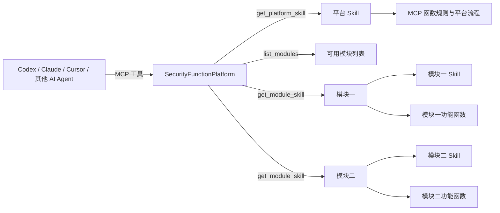

# SecurityFunctionPlatform

[English](README.md) | [简体中文](README.zh-CN.md)

SecurityFunctionPlatform 是一款面向 AI Agent 的 MCP 原生模块与 Skill 管理运行时。

平台把特定能力封装成可插拔模块。每个模块可以携带代码、工作流、配置字段、知识文件、Skill 指令、机器可读 playbook、raw output 精简规则，以及最终结果格式。Codex、Claude Desktop、Cursor 或其他兼容 MCP 的 AI 客户端可以通过平台列出模块、只加载选中模块的 Skill、运行模块函数、保存最终结果，并且在用户批准后迭代模块代码，让后续任务消耗更少 token，输出效果更稳定。

## 调用关系



## 产品定位

SecurityFunctionPlatform 不是通用低代码聊天机器人，也不是单一安全工具。它的定位是：

> 面向多 AI 客户端的本地能力运行平台，用模块管理特定功能，用 Skill 管理 AI 调用规则，用可控代码迭代持续增强模块效果。

核心目标：

- **模块化能力**：每个特定功能放在 `modules/<module_id>/` 中。
- **模块可插拔**：支持创建、导入、导出、打包、校验模块。
- **Skill 管理**：AI 先加载平台 Skill，再按用户选择加载某个模块的 Skill/playbook/schema。
- **减少 token 消耗**：AI 不需要一次读取所有模块内容，而是先 `list_modules`，再 `get_module_skill(module_id)`。
- **代码自我迭代**：用户批准后，可以把好用的函数、raw sorter、schema、知识文件沉淀回选中的模块。
- **结果持久化**：raw output、AI 精简输出、最终总结都保存在 session 目录中，方便前端展示和后续追踪。

## 下载与运行

### 1. 克隆项目

```powershell
git clone <repo-url>
cd SecurityFunctionPlatform
```

### 2. 安装依赖

```powershell
python -m pip install -e ".[dev]"
```

### 3. 启动本地 API 与 Web UI

```powershell
python -m uvicorn security_function_platform.api.main:app --reload --host 127.0.0.1 --port 8111
```

打开：

```text
http://127.0.0.1:8111/
```

常用页面：

- `http://127.0.0.1:8111/`：分析工作台，用于样本上传、session 选择、流程选择、运行 workflow、查看当前 session 最终结果。
- `http://127.0.0.1:8111/modules.html`：模块导入、导出、打包，以及流程模板管理。
- `http://127.0.0.1:8111/config.html`：本地配置字段。
- `http://127.0.0.1:8111/platform.html`：平台 Skill 路径、MCP 函数作用、模块 Skill 路径和模块函数。
- `http://127.0.0.1:8111/raw-data.html`：按 raw output map 查询原始数据和 AI 输出。
- `http://127.0.0.1:8111/result.html?session_id=<session_id>`：查看某个 session 的最终 AI 总结。

### 4. 启动 MCP Server

先启动 API，再运行：

```powershell
python -m security_function_platform.mcp_server.server
```

MCP 配置示例：

```toml
[mcp_servers.security-function-platform]
command = "python"
args = ["-m", "security_function_platform.mcp_server.server"]
cwd = "<absolute-path-to-SecurityFunctionPlatform>"
startup_timeout_sec = 10
tool_timeout_sec = 120

[mcp_servers.security-function-platform.env]
SECURITY_FUNCTION_PLATFORM_API_BASE = "http://127.0.0.1:8111"
```

安装依赖和启动 MCP Server 要使用同一个 Python 解释器。如果启动时报 `RuntimeError: mcp package is not installed`，请在项目根目录执行 `python -m pip install -e ".[dev]"`，然后重新启动 MCP Server。

## Codex 调用 MCP 的实际使用方式

Codex 是 MCP 客户端，SecurityFunctionPlatform 是本地 MCP 能力平台。模块不绑定 Codex，其他支持 MCP 的 AI 客户端也可以按同样方式调用平台。

### 1. 推荐调用流程

一次完整分析通常按这个顺序进行：

1. Codex 调用 `get_platform_skill` 读取平台规则。
2. 调用 `list_modules` 列出可用模块。
3. 让用户选择模块，除非用户已经明确指定。
4. 调用 `get_module_skill(module_id)` 只加载选中模块的 Skill、playbook 和最终结果格式。
5. 上传样本或选择已有 session。
6. 选择 workflow，或直接运行单个函数。
7. 优先分析 `ai_output`。
8. 需要证据细节时，先调用 `get_raw_output_map`，再按 `raw_output_id` 查询必要的 raw output。
9. 按模块的最终结果格式生成总结，并通过 `save_session_result` 写入 session result。

### 2. 模块选择与创建

Codex 可以使用已有模块，也可以创建新模块：

- 使用 `list_modules` 查看已有模块。
- 使用 `get_module_template` 查看默认模块结构。
- 使用 `create_module` 按默认格式创建新模块。
- 使用 `get_module_detail(module_id)` 查看模块的函数、工作流、配置字段和校验状态。

模块用于承载特定能力，例如某类分析、某类工具封装、某类报告格式或某类知识文件。平台 Skill 不应该写死模块内容，Codex 应该先发现模块，再按用户选择加载模块内容。

### 3. Workflow 与单函数调用

Codex 可以选择两种执行方式：

- **Workflow 方式**：适合稳定、可重复的任务。Codex 选择或创建一个 workflow，平台按流程运行多个函数，Codex 再分析返回的 `ai_output`，必要时继续补充分析。
- **单函数方式**：适合临时探索或补充证据。Codex 可以通过 `run_function` 在当前 session 中额外运行一个函数。

Workflow 的价值是把多步函数调用固定下来，减少 Codex 每次重新规划和解释流程的 token 消耗。

### 4. 代码编写与自迭代

Codex 默认不应该直接修改代码。涉及模块代码编写或自迭代时，需要遵守这些边界：

- 开始分析前，先询问用户是否允许本次任务进行模块代码自迭代。
- 分析完成并保存最终结果后，如果发现明确优化点，再次询问用户是否执行迭代。
- 用户批准后，只修改选中模块的文件，例如 `functions/`、`config_files/`、`config_fields/`、`skill/`。
- 样本分析过程中不自迭代平台代码。
- 好用的临时代码可以沉淀成模块函数；噪声大的输出应该优先优化模块 raw sorter。

自迭代的目标是让模块在后续任务中输出更稳定、上下文更少、效果更好。

### 5. 最终结果保存

Codex 不应该只在聊天窗口输出结论。分析结束后，需要按选中模块的 `final_result_schema` 生成最终总结，并调用 `save_session_result` 保存到：

```text
data/sessions/<session_id>/result/result.json
```

前端最终结果页读取这个 session result；如果页面为空，通常说明还没有保存最终结果。

### 6. 常见问题

- **MCP 启动失败**：检查启动 MCP Server 的 Python 环境是否安装了项目依赖，特别是 `mcp` 包。
- **模块没有出现**：检查 `modules/<module_id>/module.json` 是否存在且格式正确。
- **workflow 无法运行**：检查是否已经选择 session 和 workflow。
- **配置字段为空**：在配置中心填写工具路径、API key、token 等本地配置；密钥值前端会脱敏显示。
- **raw output 很大**：不要默认全部拉取，先看 `ai_output`，再按 `raw_output_id` 查询必要原始数据。

## 平台功能介绍与使用

### 1. 平台 Skill 加载

AI 客户端应该按这个顺序使用平台：

1. `get_platform_skill`
2. `list_modules`
3. 让用户选择模块，除非用户已经明确指定模块
4. `get_module_skill(module_id)`

`get_platform_skill` 只返回平台级规则。模块相关规则通过 `get_module_skill(module_id)` 按需加载，避免把无关模块内容塞进上下文。

### 2. 模块发现与选择

常用函数：

- `list_modules`：列出当前可用模块。
- `get_module_detail(module_id)`：查看某个模块的 manifest、函数、工作流、配置字段和校验状态。
- `get_module_skill(module_id)`：加载选中模块的 `SKILL.md`、`playbook.json`、`final_result_schema.json`。
- `list_module_knowledge`：只列出模块知识文件，不一次性加载全部内容。

模块不应该写死在平台 Skill 里。AI 应该先发现模块，再按用户选择加载对应模块内容。

### 3. 模块创建

常用函数：

- `get_module_template`：查看默认模块目录结构和 manifest 格式。
- `create_module`：按默认格式创建一个新模块。

默认模块结构：

```text
modules/<module_id>/
  module.json
  functions/
  workflows/
  knowledge/
  config_fields/
  skill/
    SKILL.md
    playbook.json
    final_result_schema.json
  config_files/
```

模块编写规则：

- 可复用函数放在 `functions/`，并声明到 `module.json`。
- 用户可配置字段放在 `config_fields/`，并声明到 `module.json`。
- 模块资源文件放在 `config_files/`。
- 模块专属 Skill、playbook、最终总结格式放在 `skill/`。
- 新建文件前，先查看目标模块目录和附近文件职责，把文件放到正确位置。

### 4. 模块导入、导出与打包

常用函数：

- `package_module(module_id)`：把模块打包成 `.sfpmod.zip`。
- `export_module(module_id)`：导出模块包。
- `import_module_archive(archive_path)`：导入可信的本地模块包。
- Web UI 首页的模块区域也提供模块导入导出能力。

模块打包会排除运行时数据、session 文件、密钥、虚拟环境和禁止导出的路径。

### 5. 函数与工作流执行

常用函数：

- `list_functions`：列出平台注册的函数，包括平台函数和模块函数。
- `list_custom_workflows`：列出已保存的平台或模块工作流模板。
- `save_custom_workflow`：保存新的工作流模板。
- `select_custom_workflow`：把工作流应用到当前 session。
- `run_workflow`：运行当前工作流，并返回精简后的 `ai_output`。
- `run_function`：在当前 session 中额外运行一个函数。

工作流模板可以带 metadata，例如风险级别、是否联网、是否需要配置、标签、是否默认安全等。AI 选择工作流时应该优先看这些字段。

### 6. Session 输出模型

平台保存三层输出：

- **Raw output**：完整原始函数输出，路径是 `data/sessions/<session_id>/raw_output/raw_output.json`。
- **AI output**：精简后的 AI 可读输出，路径是 `data/sessions/<session_id>/ai_output/ai_output.json`。
- **Final result**：AI 写入的最终总结，路径是 `data/sessions/<session_id>/result/result.json`。

AI 应该优先分析 `ai_output`。如果需要查看原始证据，流程是：

1. 调用 `get_raw_output_map(session_id)`
2. 选择需要的 `raw_output_id`
3. 调用 `get_raw_output_by_id(session_id, raw_output_id)`

默认不要一次性拉取全部 raw output。

### 7. 最终结果格式

每个模块可以定义自己的最终总结格式：

```text
modules/<module_id>/skill/final_result_schema.json
```

分析结束后，AI 应该按照选中模块的 schema 写最终总结，并调用：

```text
save_session_result(session_id, result)
```

前端最终结果页面读取：

```text
/api/sessions/<session_id>/result
```

### 8. 本地配置

真实本地配置保存在：

```text
config/local_config.json
```

这个文件被 git 忽略，AI 不应该读取或打印它。

模块的配置字段声明放在：

```text
modules/<module_id>/config_fields/
```

Web UI 的 Local Config 区域可以保存或删除配置映射。密钥字段会被 API 脱敏，不会复制到 session、workflow、raw output、AI output 或 result JSON 中。

### 9. Raw Sorting

Raw sorting 用来把噪声很大的函数输出整理成紧凑的 `ai_output`。

模块自己的 sorter 放在：

```text
modules/<module_id>/config_files/raw_sorting/
```

sorter 索引文件是：

```text
modules/<module_id>/config_files/raw_sorting/raw_sorting_index.json
```

如果输出太吵，应该优化所属模块的 raw sorter，而不是反复拉取完整 raw output 消耗 token。

### 10. 受控代码迭代

代码迭代必须经过用户批准。

推荐流程：

1. 分析开始前，询问用户本次任务是否允许模块代码自我迭代。
2. 先完成分析，并保存最终结果。
3. 如果发现值得沉淀的改进，再次询问用户是否允许写入模块。
4. 用户批准后，只修改选中模块的文件。

允许迭代的位置：

- `modules/<module_id>/functions/`
- `modules/<module_id>/config_files/`
- `modules/<module_id>/config_fields/`
- `modules/<module_id>/knowledge/`
- `modules/<module_id>/skill/SKILL.md`
- `modules/<module_id>/skill/playbook.json`
- `modules/<module_id>/skill/final_result_schema.json`

分析样本时不要自我迭代平台代码，只允许迭代选中模块。

## MCP 工具总览

平台与模块上下文：

- `get_platform_skill`
- `list_modules`
- `get_module_template`
- `get_module_skill`
- `get_module_detail`
- `list_module_knowledge`

模块生命周期：

- `create_module`
- `load_module`
- `package_module`
- `export_module`
- `import_module_archive`

Session 与工作流：

- `upload_sample`
- `upload_samples`
- `list_functions`
- `list_custom_workflows`
- `save_custom_workflow`
- `select_custom_workflow`
- `run_workflow`
- `run_function`

输出与结果：

- `get_ai_output`
- `get_ai_output_by_raw_id`
- `get_raw_output_map`
- `get_raw_output_by_id`
- `save_session_result`

受控文件访问：

- `get_mcp_file_access_policy`
- `inspect_allowed_files`
- `write_allowed_file`

## 安全规则

- 除非选中模块的工作流明确支持并且用户批准，否则不要执行上传样本。
- 不要把样本字节上传到外部服务。
- 不要读取或打印 `config/local_config.json`。
- 不要打印 API key、Auth-Key、token、密码或其他密钥。
- 不要把候选证据当作确认行为。
- 不要自动写入 `observed_behaviors`。
- 优先分析 `ai_output`，只按选定 `raw_output_id` 查看 raw output。
- 最终总结必须通过 `save_session_result` 保存。

## 验证

```powershell
python -m py_compile security_function_platform/core/function_result.py security_function_platform/core/function_base.py security_function_platform/core/function_registry.py
python -m pytest
git diff --check
```
